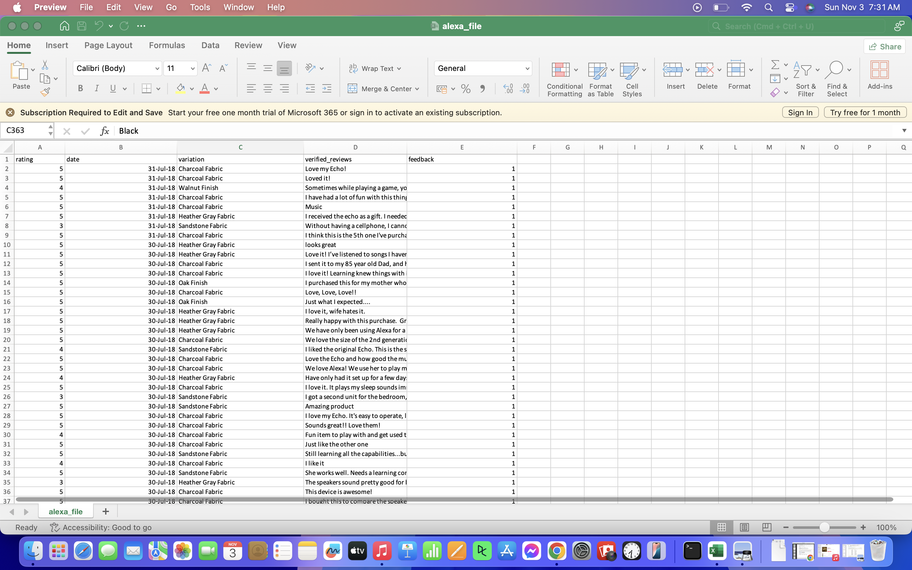

```{r setup, include=FALSE}
knitr::opts_chunk$set(echo = TRUE)
```
## 1. Using the for loop, create an R script that will displat a 5x5 matrix as 
## shown in Figure 1. It must contain vectorA = [1,2,3,4,5] and a 5 x 5 zero 
## matrix.
```{r}
vectorA <- c(1,2,3,4,5)
 matrixfive <- matrix(0, nrow = 5, ncol = 5)
  for ( i in 1:5) {
    for (  j in 1:5) {
    matrixfive [i, j] <- vectorA[abs(i - j) + 1] - 1
    }
  }
 print(matrixfive)
```

## 2. Print the string "*" using for() function. The output should be the same 
## as shown in Figure.
```{r}
for ( i in 1:5) {
  for( j in 1:i) {
    cat("* ")
  }
  cat("\n")
}
```


## 3. Get an input from the user to print the Fibonacci sequence starting from
## the 1st input up to 500. Use repeat and break statements. Write the R scripts
## and its output
```{r}
printFibonacci <- function(start){
  first <- 0
  second <- 1
  next_num <- 0
  
  if (start == 1){
      cat(first, "", second, "", second, " ")
  }
  
  for (i in 0:start){
    next_num <- first + second
    first <- second
    second <- next_num
  }
  
  repeat{
    if (next_num > 500) break
    cat(next_num, " ")
    next_num <- first + second
    first <- second
    second <- next_num
  }
}

#start <- readline(prompt = "Enter starting term: ")
start <- 1
printFibonacci(start)

```


## 4. Import the dataset as shown in Figure 1 you have created priviously.

## a. What us the R script for importing an excel or a csv file? Display the
## the first 6 rows of the dataset? Show your codes and its result.
```{r}
shoedata <- read.csv("shoesizes - Sheet1.csv")
shoedata[(1:6), ]
```


## b. Create a subset for gender (female and male). How many observations are
## there in Male? How about in Female? Show your code and its results.
```{r}
male <- subset(shoedata, Gender == "M")
print(male)

female <- subset(shoedata, Gender == "F")
print(female)
```

## c. Create a graph for the numbers of male and females for Household Data. 
##Use plot(), chart type = barplot. Make sure to place title, legends, 
## and colors. Write the R scripts and its result.
```{r}
householddata<- table(shoedata$Gender)

barplot(householddata,
        main = "Number of Males and Females",
        xlab = "Gender",
        ylab = "Count",
        col = c("Green", "Blue"),
        names.arg = c("Female", "Male"),
        legend = rownames(householddata))

```


## 5. The monthly income of Dela Cruz family was spent on the following:

## a. Create a piechart that will include labels in percentage. Add some colors
## and title of the chart.. Write the R scripts and show its output.
```{r}
category <- c("Food", "Electricity", "Savings", "Miscellaneous")
value <- c(60, 10, 5, 25 )
color = c("pink", "violet", "green", "red")
percentage <- round(value / sum(value) * 100)
percent_label <- paste(category, percentage, "%")

pie(
  value, 
  col = color,
  main = "Dela Cruz Expenses",
  label = percent_label
)

legend("topright", category, fill = color)

```


## 6. Use the iris dataset.

## a. Check for the structure of the dataset using the str() function. Describe
## what you have seen in the output.
```{r}
data(iris)
str(iris)

# the output shows the data frame of the Iris data that contains the length 
# and width of Sepal and Petal.
```


## b. Create an R object that will contain the mean of the sepal.length, sepal.
## width, petal.length, and petal.width. What is the R scripts and its result?
```{r}
datameans <-c(
  Sepal.Length = mean(iris$Sepal.Length),
  Sepal.Width = mean(iris$Sepal.Width),
  Petal.Length = mean(iris$Petal.Length),
  Petal.Width = mean(iris$Sepal.Width)
)
print(datameans)
```


## c. Create a pie chart for the Species distribution. Add titles, legends, and
## colors. Write the R script and its result.
```{r}
iris_species <- table(iris$Species)
species_color <- c("pink", "violet", "skyblue")
pie(
  iris_species,
  main = "Species Distribution",
  col = species_color
)
legend("topright", names(iris_species), fill = species_color, title = "Species")

```


## d. Subset the species into setosa, versicolor, and virginica. Write the R
## scripts and  show the last six (6) rows of each species.
```{r}
setosa <- subset(iris, Species == "setosa")
versicolor <- subset(iris, Species == "versicolor")
virginica <- subset(iris, Species == "virginica")
tail(setosa)
tail(versicolor)
tail(virginica)
```


## e. Create a scatterplot of the sepal.length and sepal.width using the
## different species(setosa,versicolor, virginica). Add a title = "Iris Dataset,
## subtitle = "Sepal width and length, labels for the x and y axis, the pch 
## symbol and colors shoulds be based on the species.

```{r}
iris$Species <- as.factor(iris$Species)

colors <- c("pink", "purple", "skyblue")
pch_symbols <- c(16, 17, 18) 

plot(iris$Sepal.Length, iris$Sepal.Width,
     col = colors[iris$Species],
     pch = pch_symbols[iris$Species],
     main = "Iris Dataset",
     sub = "Sepal Width and Length",
     xlab = "Sepal Length",
     ylab = "Sepal Width")

legend("topright", legend = levels(iris$Species),
       col = colors, pch = pch_symbols)

```

## f. Interpret the result.
```{r}
#it shows that the scatter plot displays the relationship between Sepal.Length 
#and Sepal.Width of the three given species in the iris data.

#secondly, the colors helps to track the species which shows in the figure,
#by this we we can see the overlapping relationship of the versicolor and
#virginica mean while, the setosa also portray above the overlapping relationship
#of the two, in this scatterplot helps me to identify that there is a positive 
#relationship

```

## 7. Import the alexa-file.xlsx. Check on the variations. Notice that there are 
## extra whitespaces among black variants (Black Dot,Black Plus, Black Show, 
## Black Spot). Also on the white variants (White Dot, White Plus, White Show,
## White Spot).
```{r}
#Imported alexafile
library(readxl)
alexafile <- read_xlsx("alexa_file.xlsx")
print(alexafile)


```


## a. Rename the white and black variants by using gsub() function.
```{r}
alexa_file$variation <- gsub("Black  Dot", "BlackDot", alexa_file$variation)
alexa_file$variation <- gsub("Black  Plus", "BlackPlus", alexa_file$variation)
alexa_file$variation <- gsub("Black  Show", "BlackShow", alexa_file$variation)
alexa_file$variation <- gsub("Black  Spot", "BlackSpot", alexa_file$variation)
alexa_file$variation <- gsub("White  Spot", "WhiteSpot", alexa_file$variation)
alexa_file$variation <- gsub("White  Show", "WhiteShow", alexa_file$variation)
alexa_file$variation <- gsub("White  Plus", "WhitePlus", alexa_file$variation)
alexa_file$variation <- gsub("White  Dot", "WhiteDot", alexa_file$variation)

alexa_file$variation[1050:2000]

```
## b. Get the total number of each variations and save it to another object. 
##Save the object as variations.RData. Write the RScripts. What is its result?
```{r}
library(dplyr)

alexavar <- alexafile %>%
  count(alexafile$variation)
  alexavar

save(alexavar, file = "variations.RData")

```
## c. Create the variations.RData, create a barplot(). Complete the details of
##the chart which include the title, color, labels of each bar.
```{r}
load("variations.RData")

barplot(
  alexavar$n,
  col = c("violet", "blue", "pink", "magenta"),
  main = "Total Number Of Each Variations",
  ylab = "Variants",
  names.arg = alexavar$`alexafile$variation`,         
  las = 2      
)

```
## d. Create a barplot() for the black and white variations. Plot it in 1 
## frame, side by side. Complete the details of the chart.
```{r}
load("variations.RData")

par(mfrow = c(1, 2))

black_kvar <- alexavar %>% 
  filter(`alexafile$variation` %in% c("Black", "BlackDot", "BlackPlus", "BlackShow", "BlackSpot"))

barplot(
  height = black_var$n, 
  names.arg = blackvar$`alexafile$variation`, 
  col = c("pink", "magenta", "skyblue", "grey", "purple"),           
  main = "Black Variants",
  xlab = "Total Numbers",                         
  ylab = "Variations",
  las = 2
)

white_var <- alexavar %>% 
  filter(`alexafile$variation` %in% c("White", "WhiteDot", "WhitePlus", "WhiteShow", "WhiteSpot"))

barplot(
  height = white_var$n,  
  names.arg = whitevar$`alexafile$variation`, 
  col = c("pink", "magenta", "skyblue", "grey", "purple"),              
  main = "White Variants",
  xlab = "Total Numbers",                         
  ylab = "Variations",
  las = 2
)
```

